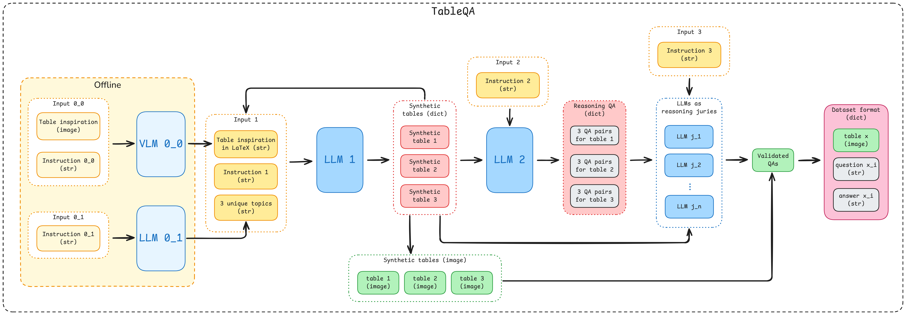

# 🧠 TableQA-Synthetic Dataset: Generating QA Datasets from Table Images

Welcome to **TableQA-Synthetic Dataset**, a project designed to generate high-quality **synthetic question-answer datasets** associated to **images of tables**. This resource is ideal for training and evaluating models on visually-grounded table understanding tasks such as **document QA**, **table parsing**, and **multimodal reasoning**.

---

## 📑 Table of Contents

- [🚀 What’s Inside](#-whats-inside)
- [🚀🚀 Getting Started](#-getting-started)
- [📘 Paper (Coming Soon)](#-paper-coming-soon)
- [📁 Repository Structure](#-repository-structure)
- [🔄 Pipeline](#-pipeline)
- [📦 Setup](#-setup)
- [📤 Dataset Access](#-dataset-access)
- [📄 License](#-license)
- [📚 Citation](#-citation)

---

## 🚀 What’s Inside

- 📓 **Notebook** for generating synthetic table images and their QA pairs
- 📓 **Notebook** for evaluating LLMs on this dataset
- 🖼️ Support for structured and stylized LaTeX tables or custom-designed visuals  
- 🔍 Automatic generation of questions and answers with ground-truth alignment  
- ⚡ Ready-to-use for fine-tuning LLMs, vision-language models, or benchmarking pipelines

---

## 🚀🚀 Getting Started
To quickly load and explore the dataset in Python, you can use the 🤗 `datasets` library:

```python
from datasets import load_dataset

# Load the test split of the Im2TeX dataset
dataset = load_dataset('AI-4-Everyone/TableQA-v2')

# Print dataset info
print(dataset)
```
---

## 📘 Paper (Coming Soon)

📝 A detailed dataset paper describing the methodology, QA strategy, and dataset statistics is coming soon.  
<!-- Replace the placeholder below with your actual paper link -->
**[📄 Read the Paper (coming soon)](https://arxiv.org/abs/XXXXX)**

---

## 🔄 Pipeline

The synthetic data generation pipeline in **TableQA-Synthetic** follows a multi-stage process combining vision-language models (VLMs), large language models (LLMs), and structured logic:

1. **Offline Preparation**: Using table images and textual prompts, a VLM and LLM generate LaTeX-style table templates and thematic concepts.
2. **Table Synthesis**: These instructions are passed to another LLM to generate diverse structured tables in JSON format, which are then rendered into images.
3. **QA Generation**: An additional LLM generates multiple QA pairs for each table, guided by reasoning-based prompts.
4. **Validation**: A group of LLMs acts as a jury to validate the correctness and relevance of each QA pair.
5. **Export**: Validated image–question–answer triplets are saved in a standardized format, ready for training and evaluation.

The complete pipeline is illustrated below:



---

## 📁 Repository Structure

```text
├── Generation/TableQA.ipynb # Main notebook to generate synthetic QA
├── Gallery/ # Example generated images and records
├── Finetuning/
├── Evaluation/
├── README.md
└── LICENSE
```
## 📦 Setup

```bash
pip install -r requirements.txt
```

## 📤 Dataset Access
You can find the generated dataset hosted on 🤗 Hugging Face:
**[TableQA Synthetic Dataset →](https://huggingface.co/datasets/AI-4-Everyone/TableQA-v2)**

## 📄 License

This project is licensed under the [MIT License](LICENSE).

You are free to use, copy, modify, merge, publish, distribute, sublicense, and/or sell copies of the software, provided that the original copyright and permission notice are included in all copies or substantial portions of the software.

## 📚 Citation

If you use this code or dataset in your research, please cite:

**Plain-text citation:**  
Marc Haraoui, Boammani Aser Lompo *Table\_QA*. GitHub repository: https://github.com/AI-4-Everyone/TableQA

**BibTeX:**
```bibtex
@misc{haraouilompo2025tableqa,
  author       = {Marc Haraoui and Boammani Aser Lompo},
  title        = {TableQA},
  year         = {2025},
  howpublished = {\url{https://huggingface.co/datasets/AI-4-Everyone/TableQA-v2}},
}
# small tweak
